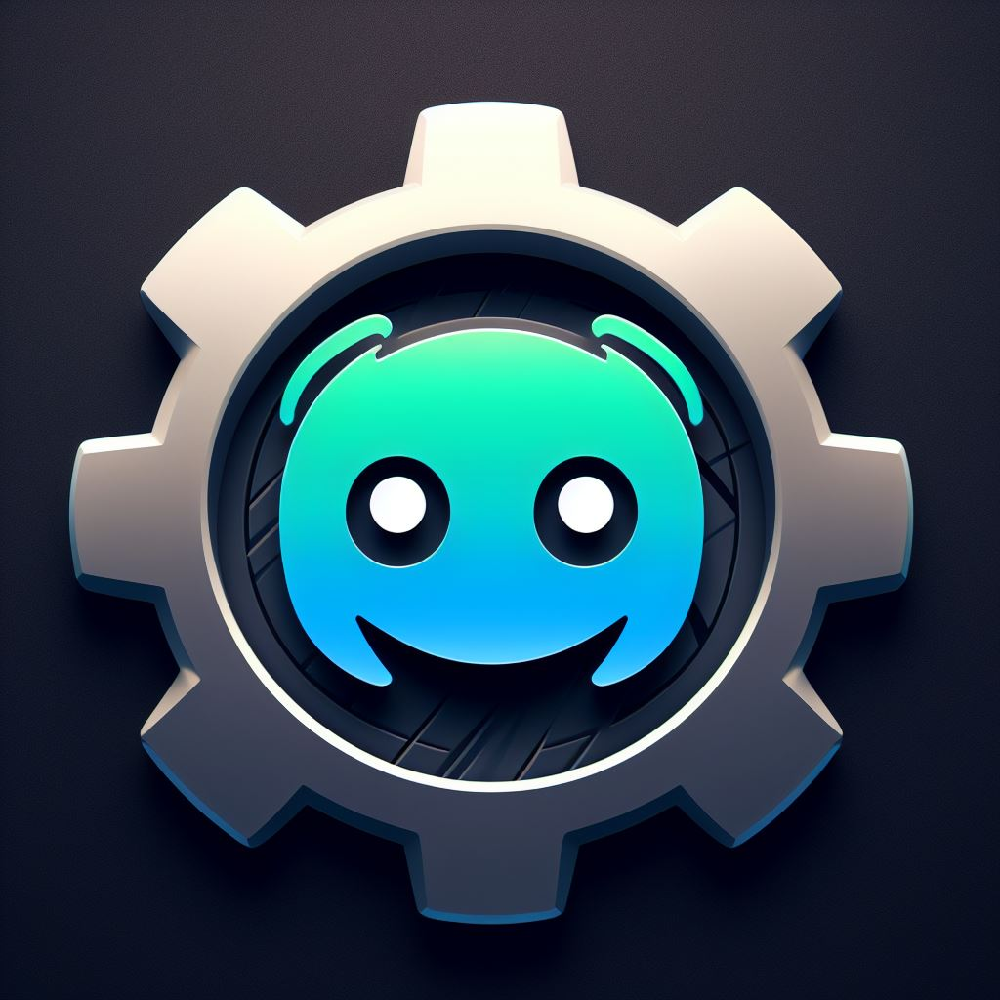

<p align="center">

</p>
<br>
<center>
<div>
<h1>DJSKit
</h1>
</div>
<p>DJSKit - Elevate your Discord bot from ordinary to extraordinary with our versatile toolkit!</p>
<p>Website - <a href="https://djskit.js.org/">Click Here!</a></p>
</center>
<p align="center">
<a href="https://npmjs.com/djskit">
  
</a>

<a href="https://npmjs.com/djskit">
  
</a>

</p>

<p align="center">
 <a  href="https://nodei.co/npm/ultrax/"></a>
 </p>

## 📥 Install

```
$ npm install djskit
```


## 🧑‍💻 Troubleshooting

You can enable debug to try to know why an event is not working:

```js
const logs = require('discord-logs');
logs(client, {
    debug: true
});
```

# 🧑 Credits
[@Androz2091](https://github.com/Androz2091) - For The Extended Events

# 🔐 License

Distributed under the Apache 2.0 License. See [`LICENSE`](https://github.com/Rtxeon/djskit/blob/main/LICENSE) for more information.

# 📢 Contact us

In case you have idea's to improve the package, or maybe you found some bugs or you need help, you can contact us in our [`Discord Server`](https://discord.gg/tHvGtcyh6V)!

<a  href="https://discord.gg/tHvGtcyh6V"></a>

